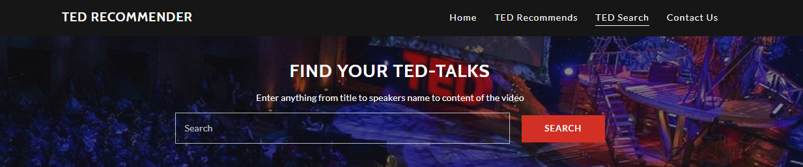
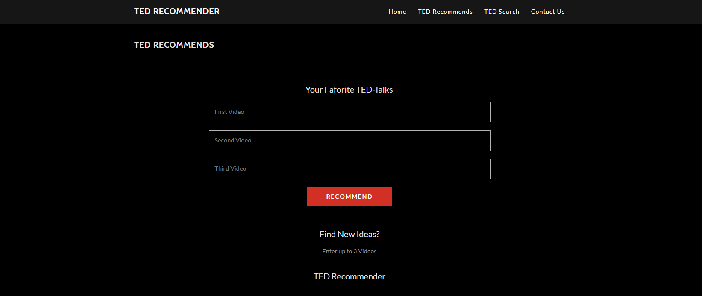
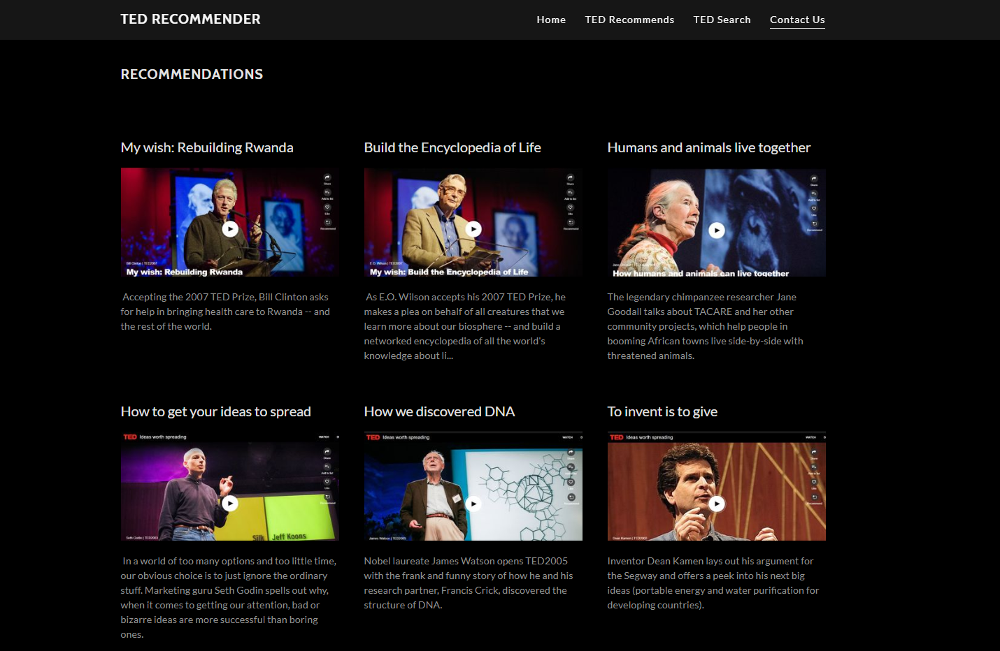
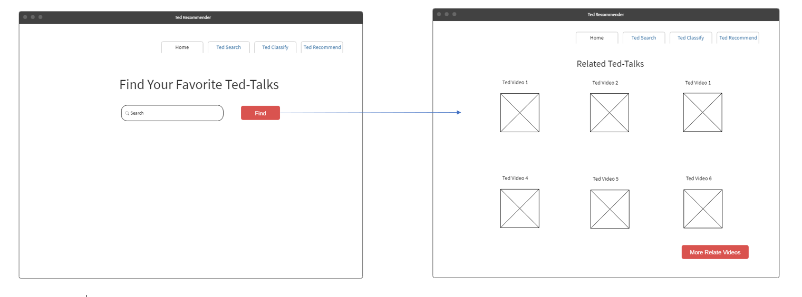
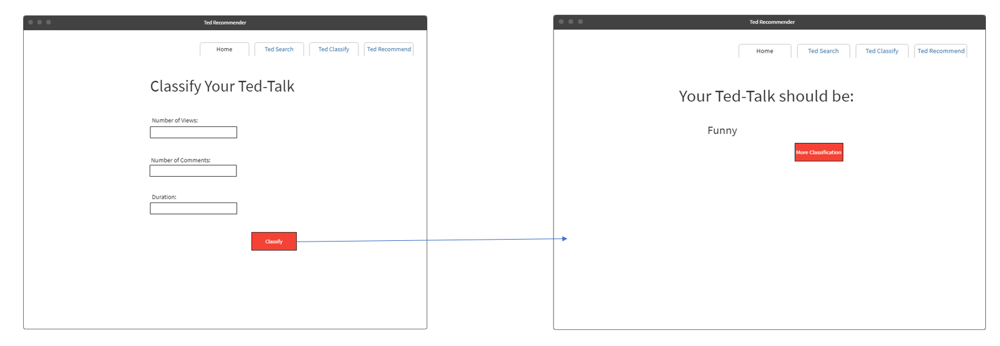

+++
# Project title.
title = "TED Recommender"

# Date this page was created.
date = 2019-01-28T00:00:00

# Project summary to display on homepage.
summary = "An application to search, classify, and recommend similar videos on TED-Talks"

# Tags: can be used for filtering projects.
# Example: `tags = ["machine-learning", "deep-learning"]`
tags = ["recommender-system", "python", "flask", "all"]

# Optional external URL for project (replaces project detail page).
external_link = ""

# Slides (optional).
#   Associate this project with Markdown slides.
#   Simply enter your slide deck's filename without extension.
#   E.g. `slides = "example-slides"` references
#   `content/slides/example-slides.md`.
#   Otherwise, set `slides = ""`.
# slides = "LCR_Proposal.pdf"

# Links (optional).
#url_pdf = ""
#url_slides = ""
#url_video = ""
#url_code = ""

# Custom links (optional).
#   Uncomment line below to enable. For multiple links, use the form `[{...}, {...}, {...}]`.
url_custom = [{icon_pack = "far", icon="file-pdf", name="Proposal", url = "https://tungpv.com/project/ted-recommender/TED-Recommender-Proposal.pdf"}, {icon_pack = "fab", icon="chrome", name="TED-Recommender Application", url = "http://3.17.150.50"}]

# Featured image
# To use, add an image named `featured.jpg/png` to your project's folder.
[image]
# Caption (optional)
# caption = "Photo by rawpixel on Unsplash"

# Focal point (optional)
# Options: Smart, Center, TopLeft, Top, TopRight, Left, Right, BottomLeft, Bottom, BottomRight
focal_point = "Left"
+++

<u>**Completed phase**</u>:

- *Brain storm idea, select dataset & design first sketches of the application*.

- *Implemented search feature*

[Read how to implemet TF-IDF weight for search](https://tungpv.com/post/how-to-search/)

- *Implement classification feature*

[Read how to implemet Naive Bayes for classification](https://tungpv.com/post/how-to-classify/)

- *Implement recommender feature*

[Read how to implemet Item-based for recommender](https://tungpv.com/post/how-to-classify/)

- *Design final Brochure and Introduce Video*

Download: [Project Brochure](https://tungpv.com/files/brochure.pdf/)

Visit: [TED-Recommender.com](http://3.17.150.50)

## Why TED Recommender?

In the rapid development society nowadays, new ideas are introduced every day. People spend more time to improve themselves by studying and adapting new skills. Learning is not restricted to schools and classrooms anymore, but people can pick up knowledge, or get inspired by an entrepreneur from another country by his stories online. With the mission to spread ideas, TED is a non-profit organization established in 1984 as a conference where Technology, Entertainment and Design converged. As the growth of the internet, TED became an online media platform with short, powerful talks, which covers almost all topics in more than 100 languages.

With hundreds of different categories, TED has their speakers, who are professional and talented from all the fields from science to business to environment, share their lesions in an 18 minutes or less online talk. Therefore, there are around 93 thousand published TED videos. What if someone just watched a TED video and would like to find that video again, but he forgot the title, and the author’s name? What if someone is interested in the videos he watched and would like to find more similar videos? TED Recommender gives them the opportunity to search for a TED video by its content, describe, or simply by title and author’s name. The application also recommends similar videos base on user’s videos list, so they can keep exploring their interests.

Front-end designs and expectations:

Sketches:

  